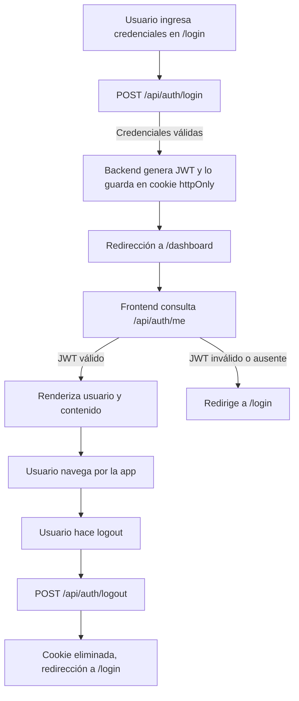

</p>
## 📚 Ejemplos de Uso de la API

### 1. Login

**Request:**
```http
POST /api/auth/login
Content-Type: application/json

{
  "email": "juan.perez@ejemplo.com",
  "password": "123456"
}
```
**Respuesta exitosa:**
```json
{
  "message": "Login exitoso",
  "user": {
    "id": 1,
    "name": "Juan Pérez",
    "email": "juan.perez@ejemplo.com",
    "role": "empleado",
    "companyId": 1,
    "officeId": 1
  }
}
```
> El JWT se almacena automáticamente en una cookie httpOnly.

### 2. Obtener usuario autenticado

**Request:**
```http
GET /api/auth/me
```
**Respuesta exitosa:**
```json
{
  "user": {
    "id": 1,
    "name": "Juan Pérez",
    "email": "juan.perez@ejemplo.com",
    "role": "empleado",
    "companyId": 1,
    "officeId": 1
  }
}
```

### 3. Logout

**Request:**
```http
POST /api/auth/logout
```
**Respuesta:**
```json
{
  "message": "Logout exitoso"
}
```
> El JWT se elimina de la cookie y la sesión se cierra.

---

## 🔄 Diagrama de Flujo de Autenticación



---

## 📑 Documentación de Endpoints de Autenticación

### POST `/api/auth/login`
- **Descripción:** Inicia sesión, valida credenciales y crea una cookie de sesión.
- **Body:**
  - `email` (string, requerido)
  - `password` (string, requerido)
- **Respuesta:**
  - 200: `{ message, user }`
  - 400/401: `{ message }`

### GET `/api/auth/me`
- **Descripción:** Devuelve el usuario autenticado si el JWT es válido.
- **Respuesta:**
  - 200: `{ user }`
  - 401: `{ message }`

### POST `/api/auth/logout`
- **Descripción:** Cierra la sesión eliminando la cookie del JWT.
- **Respuesta:**
  - 200: `{ message }`

---

## 🛡️ Ejemplo de Protección de Rutas en Frontend (Next.js)

Para proteger una página, verifica la sesión al cargar el componente:

```tsx
import { useEffect, useState } from 'react';
import { useRouter } from 'next/navigation';

export default function PaginaProtegida() {
  const [user, setUser] = useState(null);
  const router = useRouter();

  useEffect(() => {
    const checkSession = async () => {
      const res = await fetch('/api/auth/me');
      if (res.ok) {
        const data = await res.json();
        setUser(data.user);
      } else {
        router.push('/login');
      }
    };
    checkSession();
  }, []);

  if (!user) {
    return <div>Cargando...</div>;
  }

  return <div>Contenido protegido para {user.name}</div>;
}
```

---