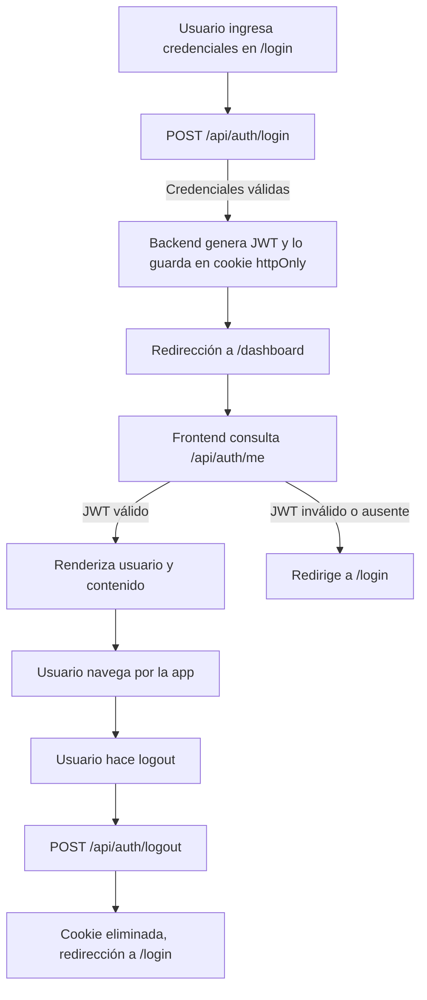

</p>
## 📚 Ejemplos de Uso de la API

### 1. Login

**Request:**
```http
POST /api/auth/login
Content-Type: application/json

{
  "email": "juan.perez@ejemplo.com",
  "password": "123456"
}
```
**Respuesta exitosa:**
```json
{
  "message": "Login exitoso",
  "user": {
    "id": 1,
    "name": "Juan Pérez",
    "email": "juan.perez@ejemplo.com",
    "role": "empleado",
    "companyId": 1,
    "officeId": 1
  }
}
```
> El JWT se almacena automáticamente en una cookie httpOnly.

### 2. Obtener usuario autenticado

**Request:**
```http
GET /api/auth/me
```
**Respuesta exitosa:**
```json
{
  "user": {
    "id": 1,
    "name": "Juan Pérez",
    "email": "juan.perez@ejemplo.com",
    "role": "empleado",
    "companyId": 1,
    "officeId": 1
  }
}
```

### 3. Logout

**Request:**
```http
POST /api/auth/logout
```
**Respuesta:**
```json
{
  "message": "Logout exitoso"
}
```
> El JWT se elimina de la cookie y la sesión se cierra.

---

## 🔄 Diagrama de Flujo de Autenticación



---

## 📑 Documentación de Endpoints de Autenticación

### POST `/api/auth/login`
- **Descripción:** Inicia sesión, valida credenciales y crea una cookie de sesión.
- **Body:**
  - `email` (string, requerido)
  - `password` (string, requerido)
- **Respuesta:**
  - 200: `{ message, user }`
  - 400/401: `{ message }`

### GET `/api/auth/me`
- **Descripción:** Devuelve el usuario autenticado si el JWT es válido.
- **Respuesta:**
  - 200: `{ user }`
  - 401: `{ message }`

### POST `/api/auth/logout`
- **Descripción:** Cierra la sesión eliminando la cookie del JWT.
- **Respuesta:**
  - 200: `{ message }`

---

## 📑 Documentación de Endpoints Protegidos

### Usuarios (`/api/users`)
- **GET** `/api/users`
  - **Descripción:** Lista usuarios con paginación y búsqueda.
  - **Query params:** `page`, `pageSize`, `search`
  - **Respuesta:** `{ users, total, page, pageSize, totalPages }`
  - **Protección:** Requiere token válido.

- **POST** `/api/users`
  - **Descripción:** Crea un nuevo usuario.
  - **Body:**  
    - `user_name` (string, requerido)
    - `user_email` (string, requerido)
    - `user_password` (string, requerido)
    - `user_status` (int, requerido)
    - `user_rol` (int, requerido)
    - `company_id` (string, requerido)
    - `office_id` (string, requerido)
  - **Respuesta:** Usuario creado o error.
  - **Protección:** Requiere token válido.

- **PUT** `/api/users`
  - **Descripción:** Edita un usuario existente.
  - **Body:**  
    - `id` (string, requerido)
    - ... (los mismos campos que POST, menos la contraseña)
  - **Respuesta:** Usuario actualizado o error.
  - **Protección:** Requiere token válido.

- **DELETE** `/api/users`
  - **Descripción:** Elimina un usuario.
  - **Body:**  
    - `id` (string, requerido)
  - **Respuesta:** Mensaje de éxito o error.
  - **Protección:** Requiere token válido.

---

### Compañías (`/api/companies`)
- **GET** `/api/companies`
  - **Descripción:** Lista compañías con paginación y búsqueda.
  - **Query params:** `page`, `pageSize`, `search`
  - **Respuesta:** `{ companies, total, page, pageSize, totalPages }`
  - **Protección:** Requiere token válido.

- **POST** `/api/companies`
  - **Descripción:** Crea una nueva compañía.
  - **Body:**  
    - `company_name` (string, requerido)
    - `company_status` (int, requerido)
  - **Respuesta:** Compañía creada o error.
  - **Protección:** Requiere token válido.

- **PUT** `/api/companies`
  - **Descripción:** Edita una compañía.
  - **Body:**  
    - `id` (string, requerido)
    - `company_name` (string, requerido)
    - `company_status` (int, requerido)
  - **Respuesta:** Compañía actualizada o error.
  - **Protección:** Requiere token válido.

- **DELETE** `/api/companies`
  - **Descripción:** Elimina una compañía.
  - **Body:**  
    - `id` (string, requerido)
  - **Respuesta:** Mensaje de éxito o error.
  - **Protección:** Requiere token válido.

---

### Oficinas (`/api/offices`)
- **GET** `/api/offices`
  - **Descripción:** Lista oficinas con paginación y búsqueda.
  - **Query params:** `page`, `pageSize`, `search`
  - **Respuesta:** `{ offices, total, page, pageSize, totalPages }`
  - **Protección:** Requiere token válido.

- **POST** `/api/offices`
  - **Descripción:** Crea una nueva oficina.
  - **Body:**  
    - `company_id` (string, requerido)
    - `office_name` (string, requerido)
    - `office_status` (int, requerido)
  - **Respuesta:** Oficina creada o error.
  - **Protección:** Requiere token válido.

- **PUT** `/api/offices`
  - **Descripción:** Edita una oficina.
  - **Body:**  
    - `id` (string, requerido)
    - `company_id` (string, requerido)
    - `office_name` (string, requerido)
    - `office_status` (int, requerido)
  - **Respuesta:** Oficina actualizada o error.
  - **Protección:** Requiere token válido.

- **DELETE** `/api/offices`
  - **Descripción:** Elimina una oficina.
  - **Body:**  
    - `id` (string, requerido)
  - **Respuesta:** Mensaje de éxito o error.
  - **Protección:** Requiere token válido.

---

### Empleados (`/api/employees`)
- **GET** `/api/employees`
  - **Descripción:** Lista empleados con paginación y búsqueda.
  - **Query params:** `page`, `pageSize`, `search`
  - **Respuesta:** `{ employees, total, totalPages }`
  - **Protección:** Requiere token válido.

- **POST** `/api/employees`
  - **Descripción:** Crea un nuevo empleado.
  - **Body:**  
    - `office_id` (string, requerido)
    - `employee_code` (int, requerido)
    - `employee_name` (string, requerido)
    - `employee_type` (string, requerido)
    - `employee_status` (int, requerido)
  - **Respuesta:** Empleado creado o error.
  - **Protección:** Requiere token válido.

- **PUT** `/api/employees`
  - **Descripción:** Edita un empleado.
  - **Body:**  
    - `id` (string, requerido)
    - ... (los mismos campos que POST)
  - **Respuesta:** Empleado actualizado o error.
  - **Protección:** Requiere token válido.

- **DELETE** `/api/employees`
  - **Descripción:** Elimina un empleado.
  - **Body:**  
    - `id` (string, requerido)
  - **Respuesta:** Mensaje de éxito o error.
  - **Protección:** Requiere token válido.

---