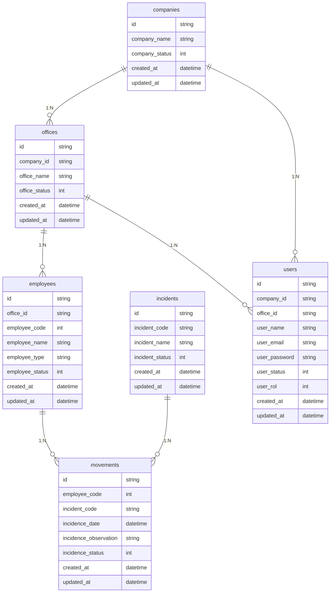

## ğŸ—ºï¸ Diagrama de Entidades y Relaciones (Base de Datos)

```mermaid
erDiagram
  companies ||--o{ offices : "1:N"
  offices ||--o{ employees : "1:N"
  employees ||--o{ movements : "1:N"
  incidents ||--o{ movements : "1:N"
  offices ||--o{ users : "1:N"
  companies ||--o{ users : "1:N"

  companies {
    id string
    company_name string
    company_status int
    created_at datetime
    updated_at datetime
  }
  offices {
    id string
    company_id string
    office_name string
    office_status int
    created_at datetime
    updated_at datetime
  }
  employees {
    id string
    office_id string
    employee_code int
    employee_name string
    employee_type string
    employee_status int
    created_at datetime
    updated_at datetime
  }
  incidents {
    id string
    incident_code string
    incident_name string
    incident_status int
    created_at datetime
    updated_at datetime
  }
  movements {
    id string
    employee_code int
    incident_code string
    incidence_date datetime
    incidence_observation string
    incidence_status int
    created_at datetime
    updated_at datetime
  }
  users {
    id string
    company_id string
    office_id string
    user_name string
    user_email string
    user_password string
    user_status int
    user_rol int
    created_at datetime
    updated_at datetime
  }
```

---

  

